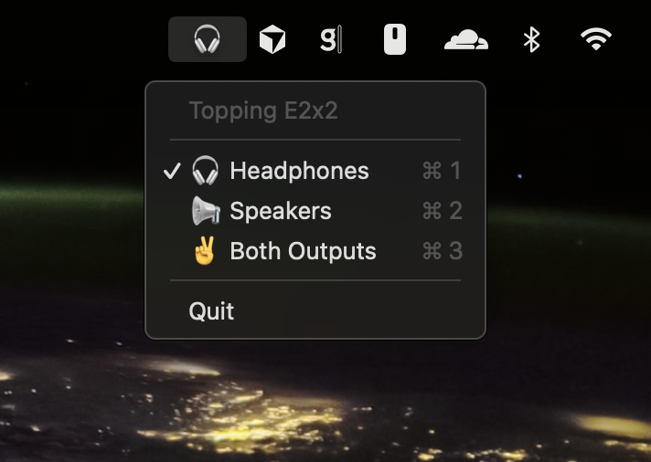

# Topping Toggle

A simple cross-platform system tray app to switch audio output between headphones and speakers on your Topping E2x2 device.



## Features

- 🎧 Quick switch to headphones only
- 📢 Quick switch to speakers only
- ✌️ Quick switch to both outputs
- Clean system tray interface
- Visual indicator of current output
- Keyboard shortcuts: `⌘1/2/3` when menu is open (macOS only)

## Installation

### macOS

1. Create and activate virtual environment:

```bash
python3 -m venv venv
source venv/bin/activate
```

2. Install dependencies:

```bash
pip install -r requirements.txt
```

### Windows

1. Create and activate virtual environment:

```powershell
python -m venv venv
venv\Scripts\Activate.ps1
```

If you get an execution policy error, run:
```powershell
Set-ExecutionPolicy -ExecutionPolicy RemoteSigned -Scope CurrentUser
```

2. Install dependencies:

```powershell
pip install -r requirements.txt
```

## Usage

### System Tray App (Recommended)

**macOS:**

```bash
source venv/bin/activate
python tray_app.py &
```

**Windows:**

```powershell
venv\Scripts\Activate.ps1
python tray_app.py
```

Look for the icon in your system tray (🎧/📢/✌️) and click it to switch outputs.

**Keyboard Shortcuts (macOS only):**

- `⌘1` - Switch to headphones (when menu is open)
- `⌘2` - Switch to speakers (when menu is open)
- `⌘3` - Switch to both outputs (when menu is open)

### Command Line

**macOS:**

```bash
source venv/bin/activate
python main.py [command]
```

**Windows:**

```powershell
venv\Scripts\Activate.ps1
python main.py [command]
```

Commands:

- `h` - Headphone only 🎧
- `s` - Speakers only 🔊
- `b` - Both outputs 🎵

## Building the App

### macOS

To rebuild the macOS application:

```bash
./build.sh
```

The app will be created in `dist/Topping Toggle.app`. Drag it to your Applications folder to install.

### Windows

To build the Windows executable:

```powershell
.\build.ps1
```

The executable will be created in `dist\Topping Toggle.exe`. You can run it directly or copy it to your desired location.

## Important Notes

⚠️ **Close ToppingPro before running this app!**

Only one application can access a HID device at a time. Make sure ToppingPro or any other Topping software is closed before using this tool.

## Device Info

- Vendor ID: `0x152A`
- Product ID: `0x8756`
- Product: Topping E2x2 OTG

## Requirements

- macOS or Windows
- Python 3.x
- Topping E2x2 device connected

**Note:** On Windows, you may need to run as Administrator if you encounter permission issues accessing the HID device.
